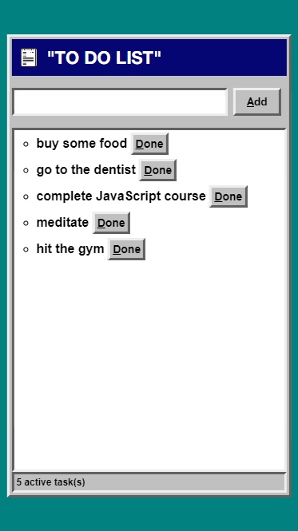
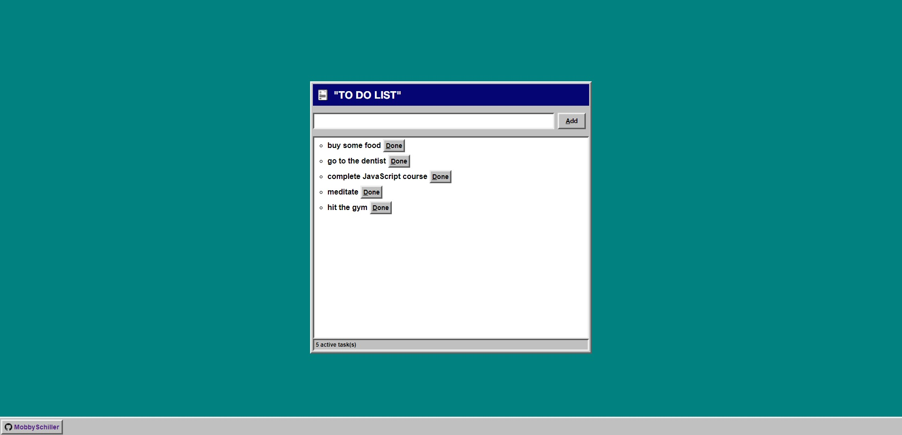

# To Do List
My first mini project with Object-oriented Programing.

## Table of contents
* [General info](#general-info)
* [Technologies](#technologies)
* [Screenshots](#screenshots)

## General info
To Do List is a great tool to organize your work by adding tasks and then completing them. This "To Do" is able to get your task and display on your screen in the list. There is option to remove task by clicking "done" button, which is located next to the task. Design is based on Windows 95 look and inspired by the works of Virgil Abloh (Off-White).

## Technologies
* HTML5
* CSS3
* Mobile first
* JavaScript

## Screenshots
 
